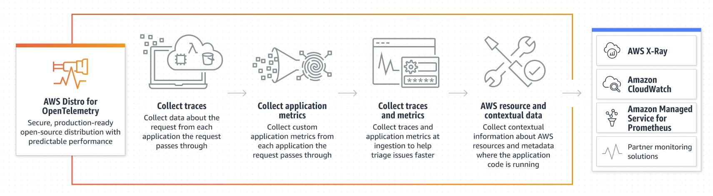

# AWS-OpenTelemetry-cloudwatch-exporter
Importing your Cloudwatch Metrics into Prometheus

* AWS Distro for OpenTelemetry<br/><br/>
The AWS Distro for OpenTelemetry is an AWS-supported distribution of the OpenTelemetry project.

With the AWS Distro for OpenTelemetry you can instrument your application to send metrics and traces 
to multiple AWS solutions such as AWS CloudWatch, Amazon Managed Service for Prometheus, AWS X-Ray or Amazon OpenSearch Service.

It can also collect metadata from your AWS resources and managed services, so you can correlate application data with infrastructure data.

The main component of the AWS Distro for OpenTelemetry is the AWS OpenTelemetry Collector which is capable of ingesting metrics 
and traces sent by the apps, process them and export them into multiple AWS solutions.

The AWS OpenTelemetry Collector complements the CloudWatch agent when you install them side-by-side, 
and then use the OpenTelemetry SDKs to collect application traces in addition to metrics and logs from 
workloads running on Amazon EKS.

* This is what AWS Distro for OpenTelemetry (ADOT) offers us:



* AWS Distro for OpenTelemetry using EKS Add-Ons

Amazon EKS add-ons support for ADOT enables a simplified experience through EKS APIs to install one component 
of ADOT, the ADOT Operator, in your Amazon EKS cluster for your metrics and/or trace collection pipeline. <br/>
Amazon EKS add-ons support reduces the amount of configuration, setup, and deployment that would be required otherwise.

This diagram shows an end-to-end pipeline utilizing the ADOT EKS add-on. <br/>
It breaks down the different components of the pipeline, as well as splits it up into three smaller pipelines; <br/>
those three pipelines are configured for:

* Discovering and collecting Prometheus metrics and sending to Amazon Managed Service for Prometheus (AMP)
* Receiving OTLP metrics, and sending to Amazon Managed Service for Prometheus (AMP) and Amazon CloudWatch
* Receiving distributed application traces, and sending them to AWS X-Ray


* The ADOT Operator and ADOT Collector

When you leverage EKS add-ons, EKS will install the ADOT Operator. The ADOT Operator is an implementation of a Kubernetes Operator, 
a method of packaging and deploying a Kubernetes-native application and managed using Kubernetes APIs. <br/>
In this case, the application is the ADOT Collector, which is a collection agent that receives, processes, and exports telemetry 
data in multiple data formats to multiple open source and vendor-service backends. <br/>
A Kubernetes Operator is a custom controller, which uses a Custom Resource Definition (CRD) to simplify the deployment and 
configuration of Custom Resources (CR). <br/>
The ADOT Operator introduces a new CR called the OpenTelemetryCollector through a CRD.

The ADOT Operator detects the presence of or changes for the OpenTelemetryCollector resource. <br/>
For any such change, the ADOT Operator performs the following actions:

* Verifies that all the required connections for these creation, update, or deletion requests to the Kubernetes API server are available.

* Deploys ADOT Collector instances in the way the user expressed in the OpenTelemetryCollector resource configuration.
The diagram below shows how the Collector CR request flows from the customer to the ADOT Operator to deploy the ADOT Collector.


The ADOT Collector is released and supported through regular ADOT releases on [Amazon Elastic Container Registry (Amazon ECR)](https://aws.amazon.com/ecr/) public 
gallery. 

* Getting Started with AWS Distro for OpenTelemetry using EKS Add-Ons

  * Grant permissions to Amazon EKS Add-ons to install ADOT with the command below.
```bazaar
kubectl apply -f https://amazon-eks.s3.amazonaws.com/docs/addons-otel-permissions.yaml
```

  * Meet the TLS certificate requirement as described in the following section. <br/>
it is recommended using the latest [cert-manager](https://cert-manager.io/docs/installation/helm/) version.

The ADOT Operator uses admission webhooks to mutate and validate the Collector Custom Resource (CR) requests. <br/>
In Kubernetes, the webhook requires a TLS certificate that the API server is configured to trust. 

  * Install cert-manager with the command:
```bazaar
kubectl apply -f https://github.com/cert-manager/cert-manager/releases/download/v1.8.2/cert-manager.yaml
```

* Installation of AWS Distro for OpenTelemetry using EKS Add-Ons

  * Install the ADOT Operator into your Amazon EKS cluster using the command:
```bazaar
aws eks create-addon --addon-name adot --cluster-name <cluster_name>
```

  * Verify that ADOT is installed and running with the command:
```bazaar
aws eks describe-addon --addon-name adot --cluster-name <cluster_name>
```
  * Create an IAM OIDC provider for your cluster by following the steps in the link below:
[Create an IAM OIDC provider for your cluster](https://docs.aws.amazon.com/eks/latest/userguide/enable-iam-roles-for-service-accounts.html)
<br/><br/>
  * Create your service account and IAM role. In this command, you must have values for the following flags:
    * For the --name flag, add the name of the service account you want to create; for this example we will name it adot-collector.
    * For the --namespace flag, use the namespace your service account will reside in; for our example we will use the default namespace.
    * For the --cluster flag, use the name of your cluster.
    * The three --attach-policy-arn values are the policies to be attached. These three policies are the policies needed for each service we want to export to. If you only plan on using 1 or 2 of the services, you only need to attach the policies for that service:
    * arn:aws:iam::aws:policy/**AmazonPrometheusRemoteWriteAccess** grants write access to the Prometheus service.
    * arn:aws:iam::aws:policy/AWSXrayWriteOnlyAccess grants write access to the AWS X-Ray service.
    * arn:aws:iam::aws:policy/CloudWatchAgentServerPolicy grants access to write the **CloudWatch service.**
    * The --override-existing-serviceaccounts flag is for if you have a service account already created in the cluster without an IAM Role. You can exclude this if that is not the case.

```bazaar
eksctl create iamserviceaccount \
    --name adot-collector \
    --namespace default \
    --cluster <your_cluster_name> \
    --attach-policy-arn arn:aws:iam::aws:policy/AmazonPrometheusRemoteWriteAccess \
    --attach-policy-arn arn:aws:iam::aws:policy/AWSXrayWriteOnlyAccess \
    --attach-policy-arn arn:aws:iam::aws:policy/CloudWatchAgentServerPolicy \
    --approve \
    --override-existing-serviceaccounts
```

* Collector Configuration

After the ADOT Operator is running in your cluster, you can deploy the ADOT Collector as a custom resource. In these instructions, we will deploy a Collector in Deployment mode to perform the following:

   * Scrape metrics and traces inside your EKS cluster.
   * Ingest the metrics to Amazon Managed Prometheus
   * Ingest metrics for CloudWatch

Traces are received in OpenTelemetry Protocol (OTLP) format. Metrics are received in Prometheus format. <br/>

* Collector Configuration for Amazon Managed Prometheus

    * Create your Amazon Managed Prometheus Workspace
    * Open your Amazon Managed Prometheus console at https://console.aws.amazon.com/prometheus/home
    * Type the name for your workspace and click create button

The Collector configuration below is set up to receive Prometheus metrics and export to Amazon Managed Prometheus. <br/>
Note that **the Prometheus receiver is meant to be a drop-in replacement for a Prometheus server and is capable of 
scraping metrics from microservices instrumented with the [Prometheus client library](https://prometheus.io/docs/instrumenting/clientlibs/).** 
It also supports the full set of [Prometheus configuration](https://github.com/prometheus/prometheus/blob/v2.28.1/docs/configuration/configuration.md#scrape_config). <br/>
The Prometheus Remote Write Exporter employs the [remote write](https://prometheus.io/docs/prometheus/latest/configuration/configuration/#remote_write) feature and sends 
metrics data to an existing Amazon Managed Prometheus workspace for long term storage. <br/>
[Here](./collector-config.amp.yaml) you have the yaml file collector-config-amp.yaml<br/>

Download the file and make sure to replace <YOUR_REMOTE_WRITE_ENDPOINT> in the prometheusremoterwite exporter config, and <YOUR_AWS_REGION> in the sigv4auth 
extension config, as per your own target environment. Note that a ClusterRole and ClusterRoleBinding will also be created, which provide 
necessary permissions for the prometheus receiver during service discovery.<br/>

then, execute this command to deploy your Collector:

```bazaar
kubectl apply -f collector-config-amp.yaml
```

* Verify if the Metrics Data is being sent to Amazon Managed Prometheus using the awscurl tool.

We can use [awscurl](https://github.com/okigan/awscurl/blob/master/README.md#installation) to check if Amazon Managed Prometheus received the metrics data. <br/>

Run the following command to check if Amazon Managed Prometheus received the Prometheus metrics data scrape_duration_seconds.

```bazaar
$ awscurl --service="aps" --region="<YOUR_AWS_REGION>" \
"https://aps-workspaces.<YOUR_AWS_REGION>.amazonaws.com/workspaces/<YOUR_AMP_WORKSPACE_ID>/api/v1/query?query=scrape_duration_seconds"
```

Output should look something like this:

```bazaar
{"status":"success","data":{"resultType":"vector","result":[{"metric":{"EKS_Container":"cert-manager","EKS_Namespace":"cert-manager","EKS_PodName":"cert-manager-858bf78c95-qvq2j","__name__":"scrape_duration_seconds","app":"cert-manager","app_kubernetes_io_component":"controller","app_kubernetes_io_instance":"cert-manager","app_kubernetes_io_name":"cert-manager","instance":"192.168.41.17:9402","job":"storefront","pod_template_hash":"858bf78c95"},"value":[1636159948.136,"0.001410662"]}]}}
```
Make sure to replace the <YOUR_AWS_REGION> and YOUR_AMP_WORKSPACE_ID fields for both queries.

* Collector Configuration for AWS CloudWatch

The Collector configuration below is set up to receive Prometheus metrics and export to CloudWatch. <br/>
Note that the Prometheus receiver configuration is identical to that of the configuration for the Amazon Managed 
Prometheus Collector configuration. <br/>

The AWS CloudWatch EMF Exporter is used to convert the metrics data into performance log events with [Embedded Metric 
Format](https://docs.aws.amazon.com/AmazonCloudWatch/latest/monitoring/CloudWatch_Embedded_Metric_Format_Specification.html) (EMF) 
and then sends it directly to a CloudWatch log group using the [PutLogEvents](https://docs.aws.amazon.com/AmazonCloudWatchLogs/latest/APIReference/API_PutLogEvents.html) API. <br/>
From this data, your metrics will be made available under the CloudWatch Metrics https://docs.aws.amazon.com/AmazonCloudWatch/latest/monitoring/cloudwatch_concepts.html#Namespace 
ContainerInsights/Prometheus with the [dimensions](https://docs.aws.amazon.com/AmazonCloudWatch/latest/monitoring/cloudwatch_concepts.html#Dimension) EKS_Cluster, 
EKS_Namespace, and EKS_PodName per the exporter configuration settings.<br/>
Save this into a file [collector-config-cloudwatch.yaml](./collector-config-cloudwatch.yaml) and execute the command to deploy your Collector:

```bazaar
kubectl apply -f collector-config-cloudwatch.yaml
```
Make sure to replace <YOUR-EKS-CLUSTER-NAME> in the spec::env section and <YOUR_AWS_REGION> in the awsemf exporter config, 
as per your own target environment. <br/>
Note that a ClusterRole and ClusterRoleBinding will also be created, which provide necessary permissions for the prometheus 
receiver during service discovery.

* Verify if the Metrics Data is being sent to CloudWatch.

   * Open the [CloudWatch console](https://console.aws.amazon.com/cloudwatch/home)
   * Select “Metrics → All metrics” in the menu on the left
   * Click the “ContainerInsights/Prometheus” box under “custom namespaces”
   * Select the “EKS_Cluster, EKS_Namespace, EKS_PodName“ to view your metrics data


